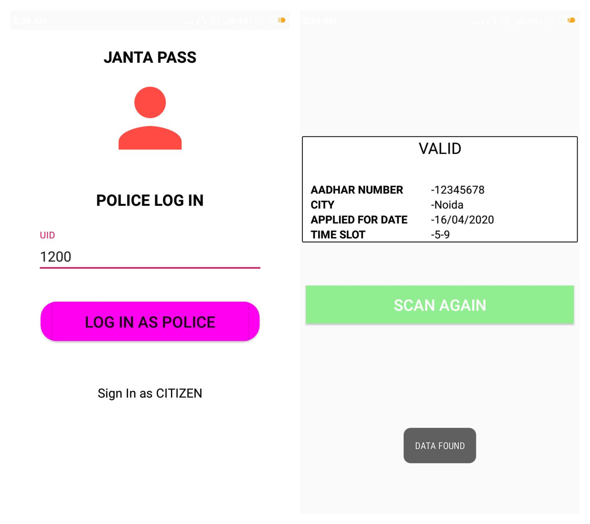

<h1 align="center"> Covid App</h1>
Our Solution 
Made a fully functioning prototype solution app that solves problem faced during COVID-19 crisis.
•Idea is to generate e-pass based in form of QR code to people who need to go out.
•Police will have an alternate login in app through unique police ID , using this login they can scan and verify the pass.On scanning they get all necessary information like name aadhar id , date and time till pass is valid. 

## Features
<ul>
 <li>Generation of E-Pass on basis of aadhar details in form of qr code.</li>
<li>Seperate login for police with integrated qr code scanner to verify the pass.</li>
<li>Mass gathering reporting through app. </li>
<li>Additionally app shows live official corona updates of India state- wise , helpline numbers and other important information related to Covid-19.</li>
</li>
</ul>

## Links
- **Android Apk**:https://lnkd.in/d3yU8kg 
- **App video**:https://lnkd.in/dpx7xf2

## SCREENSHOTS
  ## 1
  
  
  
  
  
   ## 2
  
  
  
  
  
  
   ## 3
  

## **Thank You**
Made with Love ❤️️  &  Passion 🙏.
